# Scyliorhinus canicula dental regeneration RNA-seq

<p align="center">
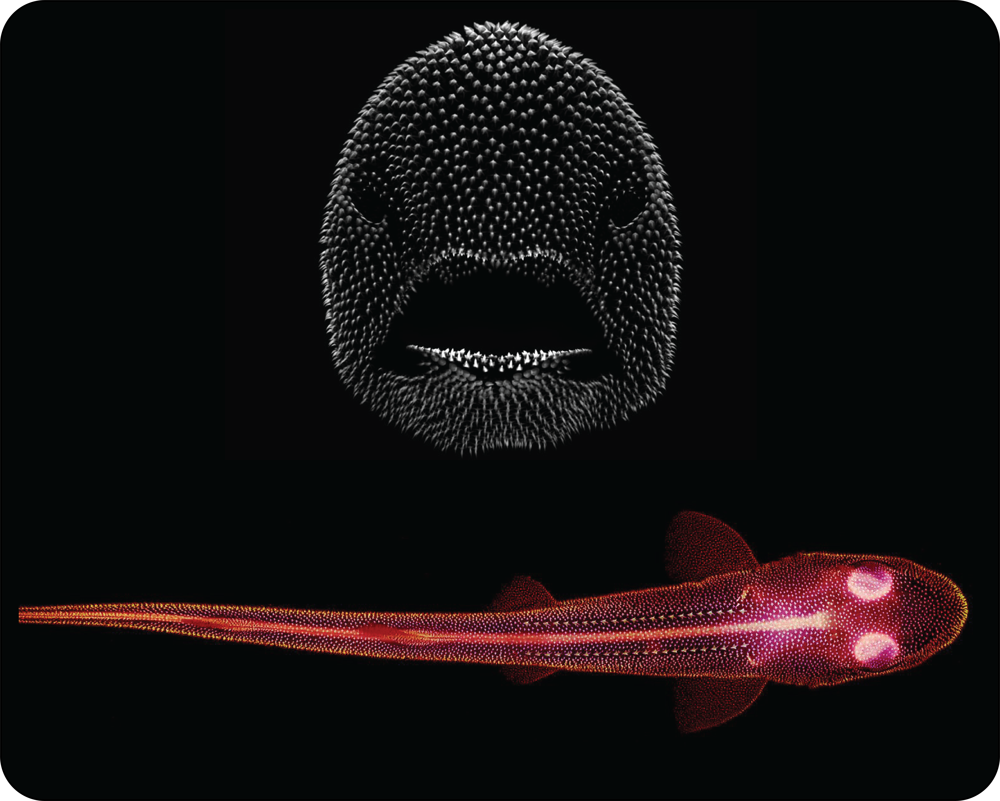
</p>

Code and processed data for the differential-expression and gene-regulatory-network
analysis of the small-spotted catshark (*Scyliorhinus canicula*) dental lamina. Bulk
RNA-seq was generated from five micro-dissected dental tissues, each in triplicate
(BHTB, TTJ, **SL** — the successional lamina — ET and LT), and analysed against a de novo
transcriptome assembly.

The entire analysis is contained in a single script, **`DE_analysis.R`**, which is run
top to bottom. All figures and tables it produces are provided under
[`suppl_files/dea_output/`](./suppl_files/dea_output).

> **Citation.** This repository accompanies the manuscript:
>
> Thiery A.P., Martin K.J., James K., Cooper R.L., Standing A.S.I., Dillard W.A.,
> Howitt C., Nicklin E.F., Cohen K.E., Byrum S.R., Johanson Z. & Fraser G.J.
> *Continuous tooth regeneration: RNAseq reveals genes for unlimited dental renewal in sharks.*
>

---

## Data availability

- **RNA-seq data** — NCBI Gene Expression Omnibus, accession [GSE198580](https://www.ncbi.nlm.nih.gov/geo/query/acc.cgi?acc=GSE198580).
- **Raw sequencing reads** — NCBI Sequence Read Archive, BioProject [PRJNA816069](https://www.ncbi.nlm.nih.gov/bioproject/PRJNA816069).
- **De novo transcriptome assembly** (`Scan_de_novo.fasta`) — supplementary file under GEO accession [GSE198580](https://www.ncbi.nlm.nih.gov/geo/query/acc.cgi?acc=GSE198580).
- **Processed inputs in this repository** ([`data/`](./data)):
  - `data/expression/de_novo.gene.counts.matrix` — Trinity gene-level count matrix (15 samples).
  - `data/annotations/protein_annotations_de_novo.tab` — Trinotate-style functional annotation of the assembly (BlastP/BlastX, Pfam, KEGG, GO). The `GO_blast` / `GO_pfam` columns supply the GO terms used for enrichment.

The transcriptome assembly, quantification and functional annotation that produced these
inputs were performed upstream of this repository (see paper Methods).

## Repository structure

```
DE_analysis.R                       full analysis (run this)
Dockerfile                          R 4.3 / Bioconductor 3.18 environment (restores renv.lock)
renv.lock                           pinned package versions (169 packages)
sessionInfo.txt                     sessionInfo() from the run used to generate the results
LICENSE                             MIT
data/
  expression/                       Trinity count matrix
  annotations/                      de novo transcriptome annotation
suppl_files/
  dea_output/                       all figures/tables produced by DE_analysis.R
  RNEA_output/
    Network.csv                     RNEA network output (input checkpoint, see below)
    cytoscape/                      manually laid-out network figures + Cytoscape session
  header.png
.github/workflows/
  docker-pull.yml                   scheduled pull to keep the Docker Hub image from expiring
```

## Requirements & environment

The analysis was run under **R 4.3.3 / Bioconductor 3.18**. Two records of the exact
environment are provided:

- [`renv.lock`](./renv.lock) — machine-readable lockfile pinning all 169 packages (restore with `renv::restore()`).
- [`sessionInfo.txt`](./sessionInfo.txt) — human-readable `sessionInfo()` from the session used to generate the results.

Key packages: DESeq2 1.42.1, GOstats 2.68.0, GSEABase 1.64.0, kohonen 3.0.12,
pheatmap 1.0.13, ggplot2 3.5.2, tidyverse 2.0.0.

The `Dockerfile` builds a matching image (base `bioconductor/bioconductor_docker:RELEASE_3_18`,
restoring `renv.lock`), published to Docker Hub as `alexthiery/scanicula-dea:latest`.

## Quick start

Run in the pinned Docker image:

```bash
docker pull alexthiery/scanicula-dea:latest
docker run --rm -v "$PWD":/work -w /work alexthiery/scanicula-dea:latest \
  Rscript DE_analysis.R
```

…or run locally in R/RStudio with the repository root as the working directory:

```r
renv::restore()        # install the exact package versions from renv.lock
source("DE_analysis.R")
```

Outputs are written to `suppl_files/dea_output/` (the committed copies there are the
reference results).

## Analysis walkthrough

`DE_analysis.R` runs in the following order; the section headers below match the banners
in the script.

### 1. Load and prepare data
Counts are restricted to annotated genes, TRINITY IDs are replaced with gene names, and a
DESeq2 object is built with the design `~ 0 + Group + Pool` (tissue, with the biological
pool as a covariate). Genes with fewer than 5 counts in at least 2 samples are removed and
the data are rlog-transformed for clustering.

### 2. QC plots
Distribution of rlog values, sample–sample distances, and PCA. Samples cluster by tissue
rather than by pool, indicating that tissue identity — not replicate variation — drives
the expression differences.

| rlog histogram | Sample distances | PCA |
| :---: | :---: | :---: |
| 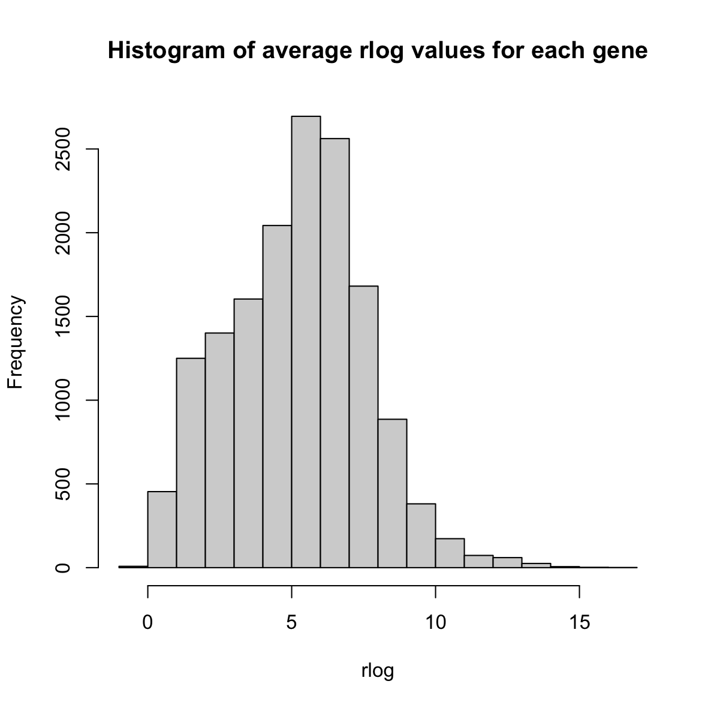 | 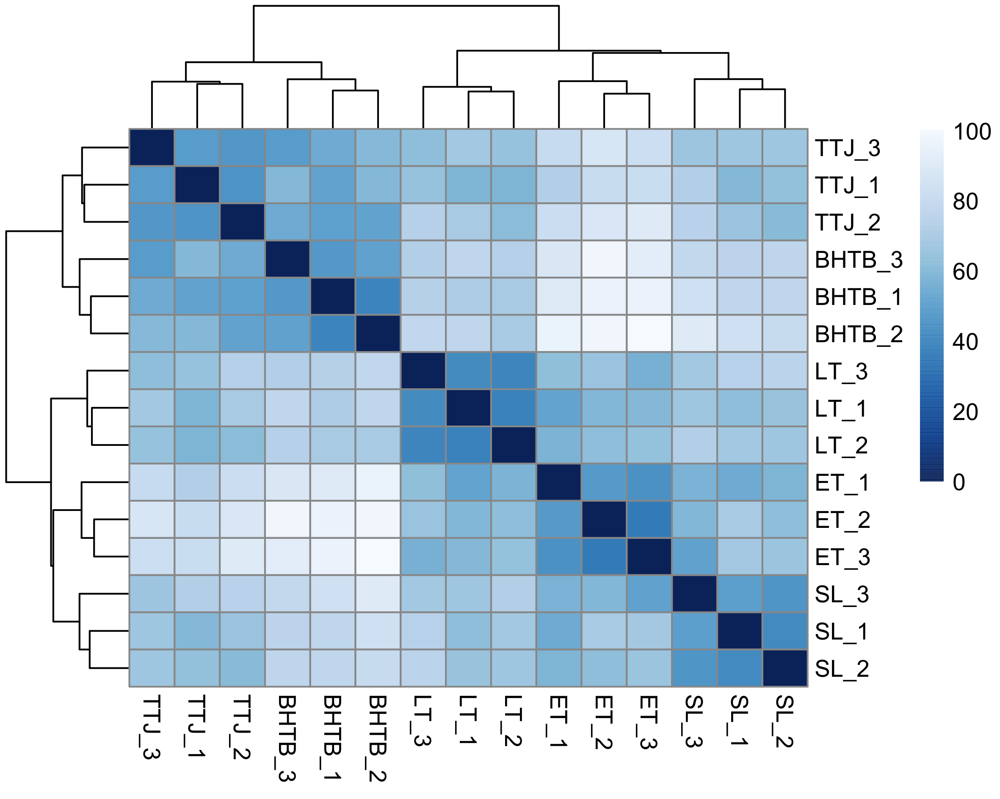 | 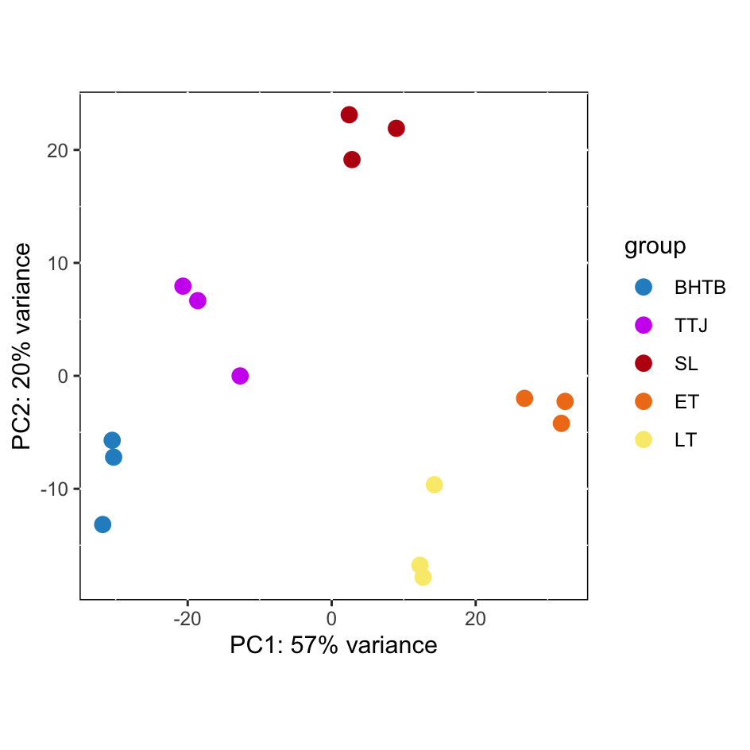 |

### 3. LRT differential expression and SOM clustering
A DESeq2 likelihood-ratio test (full `~ 0 + Group + Pool` vs reduced `~ 0 + Pool`)
identifies genes that vary as a function of tissue (padj < 0.0001). These are clustered
with self-organising maps (`kohonen`, 5×5 hexagonal grid) and visualised as per-tissue
average violins; each cluster is assigned to its highest-expressing tissue.
Per-cluster gene lists: [`cluster_gene_list.csv`](./suppl_files/dea_output/cluster_gene_list.csv).
The per-replicate version of the SOM violins is
[`SOM_DEgenes_violin.png`](./suppl_files/dea_output/SOM_DEgenes_violin.png).

| DE heatmap (LRT) | SOM clusters (per-tissue mean) |
| :---: | :---: |
| 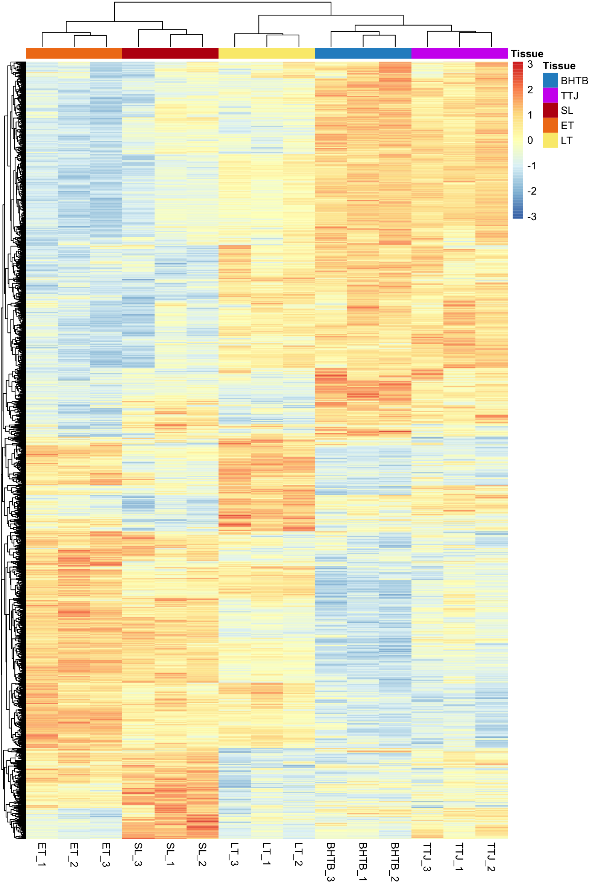 | 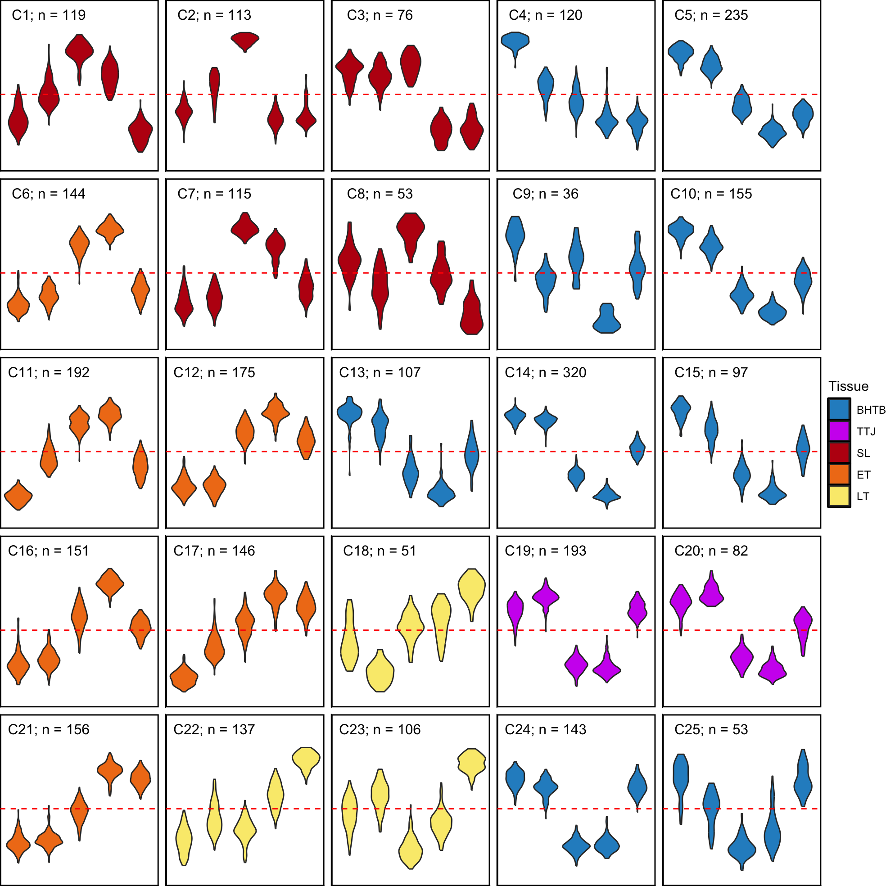 |

### 4. GO enrichment (per SOM tissue cluster)
GO biological-process enrichment (GOstats / GSEABase hypergeometric test, BH-corrected) is
run per tissue super-cluster, using the assembly's GO annotations as the gene universe.
Full per-tissue tables:
[BHTB](./suppl_files/dea_output/functional_enrichment/top_go_BHTB.csv) ·
[TTJ](./suppl_files/dea_output/functional_enrichment/top_go_TTJ.csv) ·
[SL](./suppl_files/dea_output/functional_enrichment/top_go_SL.csv) ·
[ET](./suppl_files/dea_output/functional_enrichment/top_go_ET.csv) ·
[LT](./suppl_files/dea_output/functional_enrichment/top_go_LT.csv).
A curated set of terms is shown in the dot plot below.

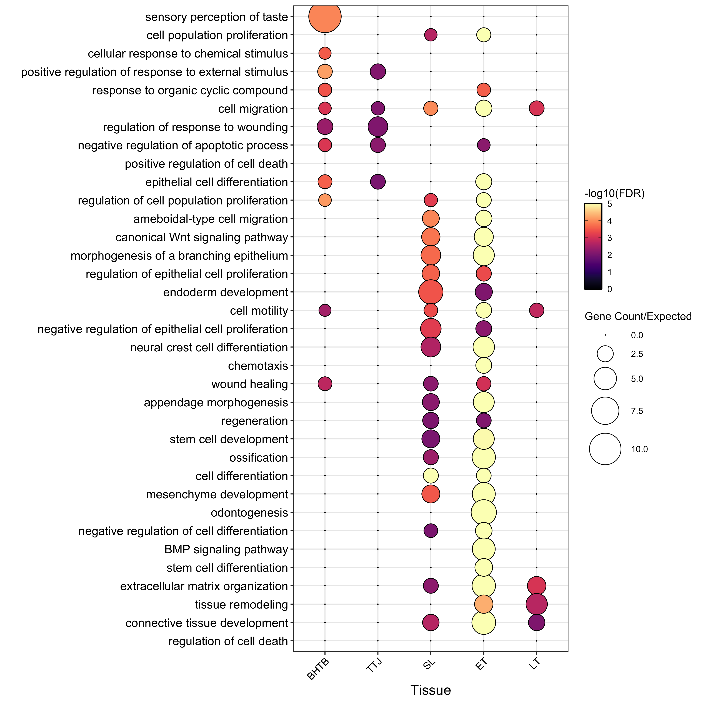

### 5. RNEA regulatory network
To find putative regulators of the successional lamina, a conservative SL-vs-all-tissues
contrast (|log2FC| > 0.75, FDR < 0.001;
[`SLvsALL_dea_res.tsv`](./suppl_files/dea_output/SLvsALL_dea_res.tsv)) defines the
differentially expressed gene set, which — plus the known markers `SOX2` and `BMP4` — is
written to [`RNEA_input.txt`](./suppl_files/dea_output/RNEA/RNEA_input.txt) and used as
input to **RNEA**.

RNEA is run **outside this repository** (see [external steps](#steps-performed-outside-this-repository)).
Its network output is provided as
[`suppl_files/RNEA_output/Network.csv`](./suppl_files/RNEA_output/Network.csv), and the
script reads that file as a checkpoint so the downstream network processing runs
end-to-end. The network is then filtered to genes within two degrees of pre-defined
central nodes (`CTNNB1`, `PITX1`, `PITX2`, `SOX2`, `LEF1`, `BMP4`, `SHH`), iteratively
pruned of singly-connected genes, and annotated with DE status and transcription-factor
identity ([`grn_metadata.csv`](./suppl_files/dea_output/RNEA/grn_metadata.csv), plus the
filtered network CSVs under [`RNEA/`](./suppl_files/dea_output/RNEA)).

### 6. Network heatmaps
rlog expression heatmaps of the network genes, the filtered network, the direct-central-node
("no-sep") network, and its transcription-factor subset. Row annotations mark DE status
(upregulated / downregulated / non-significant in the SL). The full network heatmap is
[`network_hm.png`](./suppl_files/dea_output/network_hm.png).

| Filtered network | Central-node network | Central-node TFs |
| :---: | :---: | :---: |
| 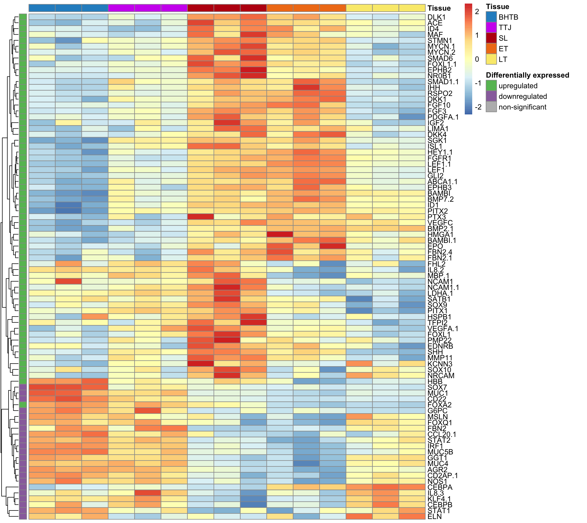 | 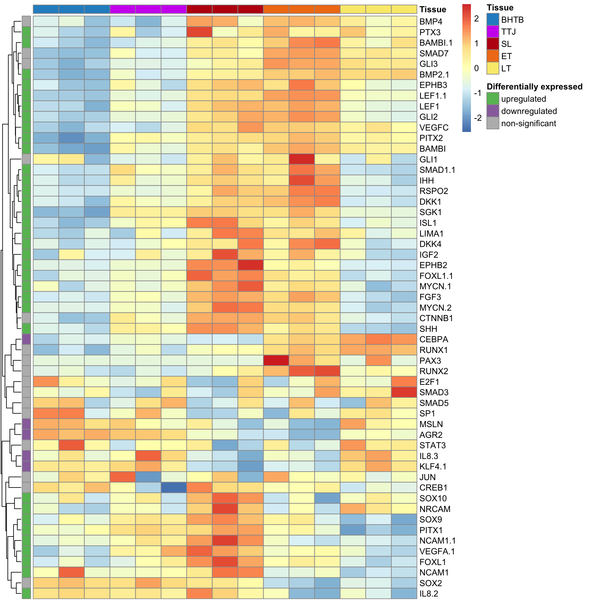 | 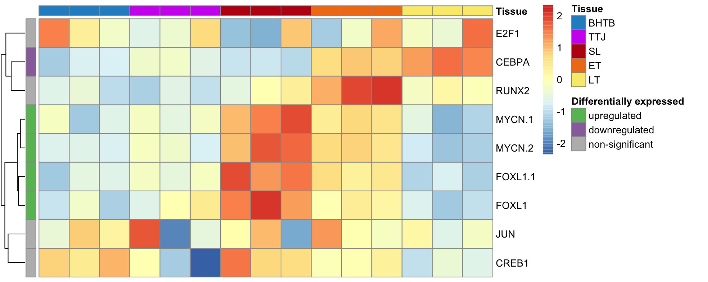 |

### 7. SOM candidate overlay & MYC-family heatmap
Key filtered-network genes are overlaid on the SOM violins. Since **MYCN** emerges as the
novel SL regulator from the network analysis, the rlog expression of the MYC-family
transcripts and `SHH` is also plotted.

| SOM candidate overlay | MYC-family heatmap |
| :---: | :---: |
| 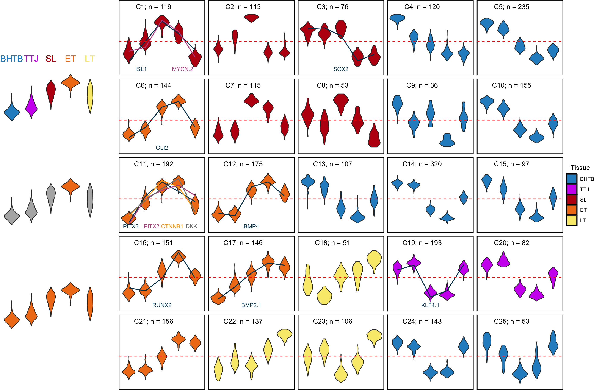 | 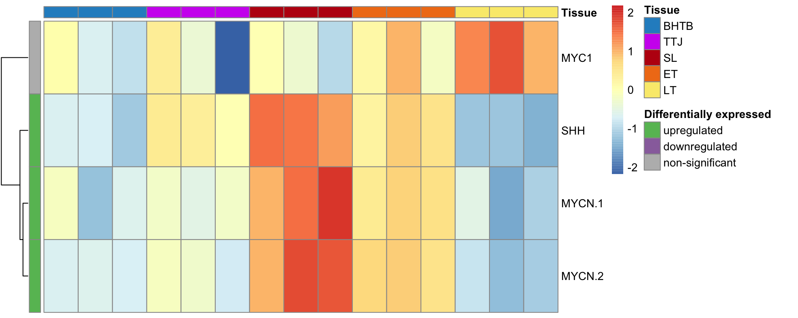 |

### 8. Candidate regulator bar plots (Figure 7)
For the candidate regulators identified from the network analysis above, DESeq2-normalised
counts per tissue (bars = tissue mean, error bars = ± SEM, points = the three replicates).
One plot per gene is written to
[`suppl_files/dea_output/candidate_gene_barplot/`](./suppl_files/dea_output/candidate_gene_barplot).

| LEF1 | BMP4 | DKK1 |
| :---: | :---: | :---: |
| 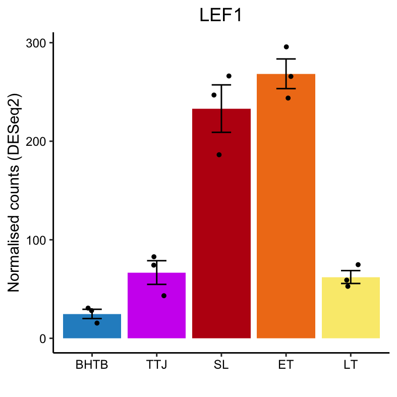 | 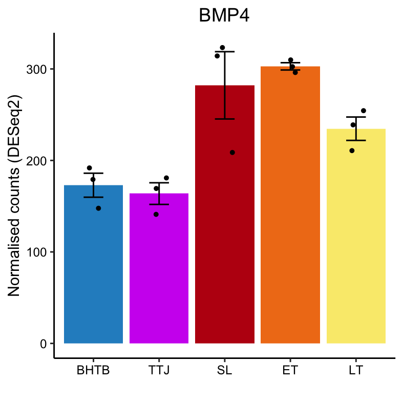 | 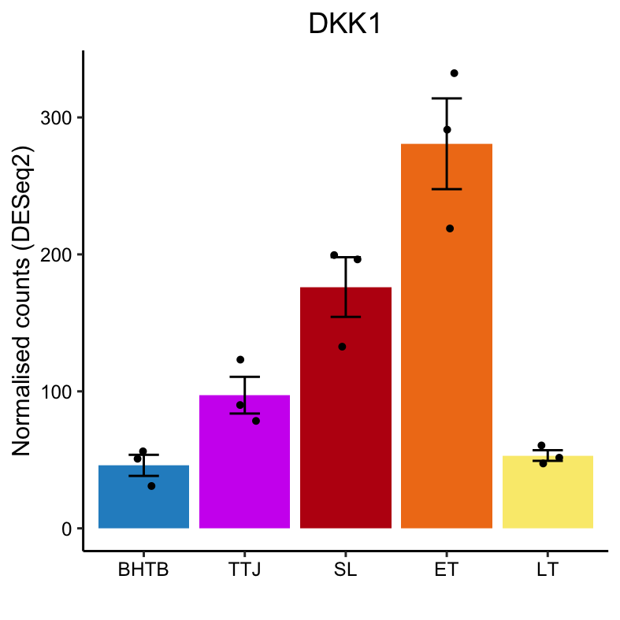 |
| **PITX1** | **PITX3** | **MYCN.1** |
| 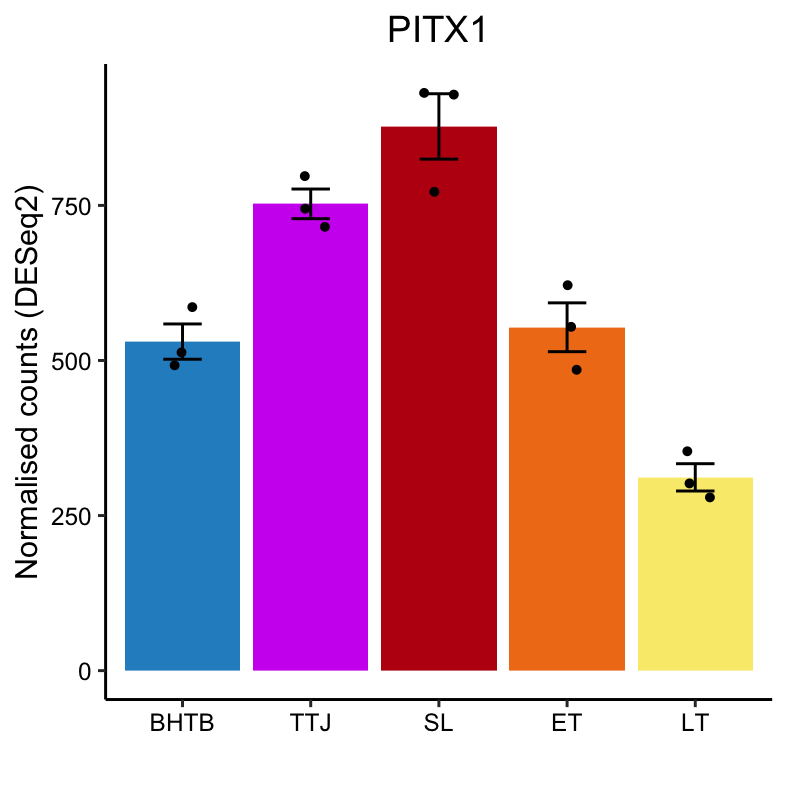 | 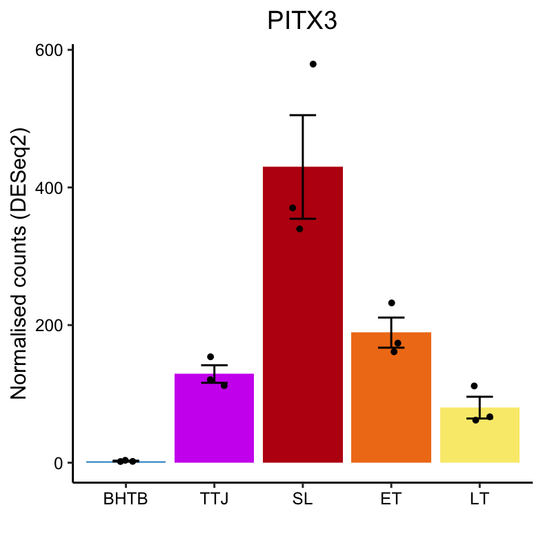 | 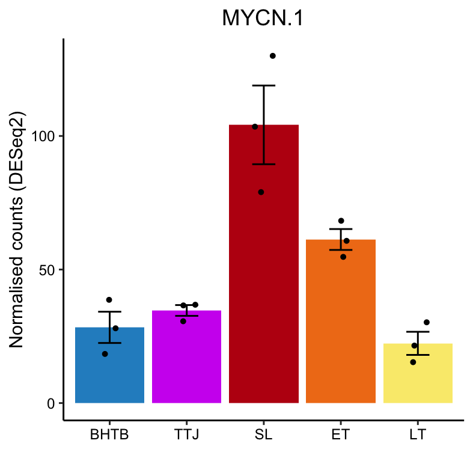 |

## Steps performed outside this repository

These steps are part of the paper but are **not scripted here**; reproduce them manually
using the referenced inputs/outputs.

- **De novo assembly, quantification and functional annotation** — produced the files in `data/` (Trinity + Trinotate/BLAST/Pfam/GO), upstream of this repo.
- **RNEA regulatory-network inference** — RNEA (Chouvardas, Kollias & Nikolaou, *BMC Bioinformatics* 17:319, 2016, [doi:10.1186/s12859-016-1040-7](https://doi.org/10.1186/s12859-016-1040-7); <https://sites.google.com/a/fleming.gr/rnea/>) is third-party software with database-derived reference files (including KEGG) and is not redistributed here. It was run on `RNEA_input.txt`; its output is provided as `suppl_files/RNEA_output/Network.csv`, which `DE_analysis.R` reads directly.
- **Cytoscape visualisation** — the network figures were laid out manually in Cytoscape. The rendered images and the [Cytoscape session](./suppl_files/RNEA_output/cytoscape/filtered_noiso_nosep.cys) are in [`suppl_files/RNEA_output/cytoscape/`](./suppl_files/RNEA_output/cytoscape).

  | Full RNEA network | Filtered central-node network |
  | :---: | :---: |
  |  | 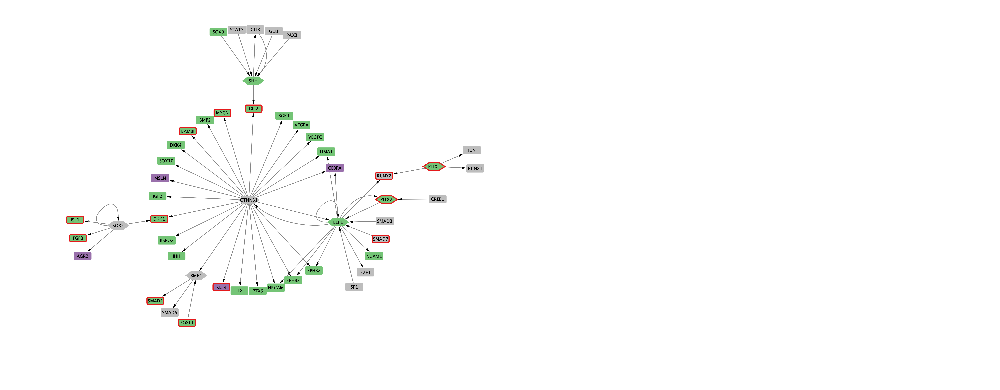 |

## License

Released under the MIT License — see [`LICENSE`](./LICENSE).
